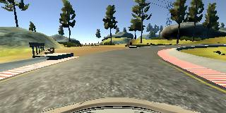

# Introduction
The goal of this project is to implement a deep neural network able to steer a car in a driving simulator provided by the Udacity team.

# Dataset
It was possible to create the dataset by means of the driving simulator itself, but I did not manage to obtain a good dataset by using the keyboard controls only. Therefore I decided to use the dataset provided by Udacity:

* number of images taken from a center camera: 8036
* number of images taken from a camera translated to the left: 8036
* number of images taken from a camera translated to the right: 8036
* image format: JPG
* channels: 3 (RGB)
* dimensions: 320x160

Attributes available in the dataset:

* 'center' - center camera image
* 'left' - left camera image
* 'right' - right camera image
* 'steering' - steering angle at the time the images was taken
* 'throttle' - throttle value (not used)
* 'brake' - brake value (not used)
* 'speed' - speed value (not used)

## Additional left and right camera images
For each data point, two images were taken from two cameras translated to the right or to the left. Those images have been used to train the neural network to properly recover from cases when either the car is very close to the sides of the track or even outside of the track.

Since only the steering angle for the center image was available, the steering angles for the left and right camera images have been calculated using a correction factor (i.e. steer harder to the left or to the right if the car is going off-track).

The steering angle correction has been set to 0.09 after some tries.

# Dataset augmentation

Sources:

* [NVIDIA - End to End Learning for Self-Driving Cars](http://images.nvidia.com/content/tegra/automotive/images/2016/solutions/pdf/end-to-end-dl-using-px.pdf) 
* [Kaspar Sakmann's post on Medium.com](https://medium.com/@ksakmann/behavioral-cloning-make-a-car-drive-like-yourself-dc6021152713#.x6726z838)

In order to improve the quality of the dataset, I applied some basic augmentation techniques, as suggested in the source I listed above.

## Shear
During the generation of images, some of them were sheared, in order to try and balance the straight road images with the ones containing curves

## Horizontal flip
In order to balance left and right curves, the images have been randomly flipped

## Brightness
In order to mitigate the risk of overfitting the training set, the brightness of some images has been randomly modified as well.

# Preprocessing

The sky part and the bonnet part have been removed from each image. Other preprocessing steps have been tried (e.g. CLAHE or contrast equalization), but they did not lead to any improvements.

Before being fed to the neural network, the images dimensions are resized to 64x64 pixels. This allowed to have the model trained even without a huge amount of memory required.

## Model architecture

The model architecture is based on the one suggested in the Nvidia paper, with only small modifications related to the dropout layers.

* Lambda function to center the values (lambda x: x / 127.5 - 1.0) - Input shape is 64x64x3
* Convolution2D
* ReLU
* Max Pooling
* Convolution2D
* ReLU
* Dropout(0.5)
* Max Pooling
* Convolution2D
* ReLU
* Dropout(0.5)
* Max Pooling
* Convolution2D
* ReLU
* Max Pooling
* Convolution2D
* ReLU
* Max Pooling
* Flatten
* Dropout = 0.25
* Fully connected layer
* ReLU
* Fully connected layer
* ReLU
* Fully connected layer
* ReLU
* Fully connected layer (10)
* ReLU
* Fully connected layer (1 output only, the steering angle)

## Training method and hyperparameters

1. Optimizer: Adam
2. Learning rate: 0.001
3. Number of epochs: 7 (with EarlyStopping callback, patience=1)
4. Samples per epoch: 25600
5. Validation samples: 5120
6. Batch size: 64
7. Steering angle correction for left and right images: 0.09

In order to optimize the training time, I used an EarlyStopping callback in the model fit method:

* EarlyStopping(monitor='val_loss',patience=1,verbose=0)

1. Epoch 1/10 - loss: 0.0237 - val_loss: 0.0172
2. Epoch 2/10 - loss: 0.0127 - val_loss: 0.0166
3. Epoch 3/10 - loss: 0.0123 - val_loss: 0.0130
4. Epoch 4/10 - loss: 0.0137 - val_loss: 0.0171
5. Epoch 5/10 - loss: 0.0152 - val_loss: 0.0118
6. Epoch 6/10 - loss: 0.0119 - val_loss: 0.0120
7. Epoch 7/10 - loss: 0.0115 - val_loss: 0.0118

Moreover, I added a ModelCheckpoint callback to only save the best model:

*  ModelCheckpoint('best.h5', monitor='val_loss', verbose=0, save_best_only=True, save_weights_only=True, mode='auto', period=1)

# Conclusions and potential improvements

The model behaves correctly on track #1, in all graphic quality settings. It works well too on track #2, but only when the graphics quality is set to "Fastest" (i.e. no shadows on the road). When shadows are cast, the model does not react well and is unable to predict a proper steering angle. In order to improve this the dataset should be enriched either with samples from track #2 or with artificially generated data (e.g. shadows artificially cast on images)

## Sample videos

[Track 1](https://youtu.be/pqAWmNnrKOs)

[Track 2](https://youtu.be/XQlUjJBDQbU)

[Track 2 with shadows](https://youtu.be/Cw4QBszewiE)

